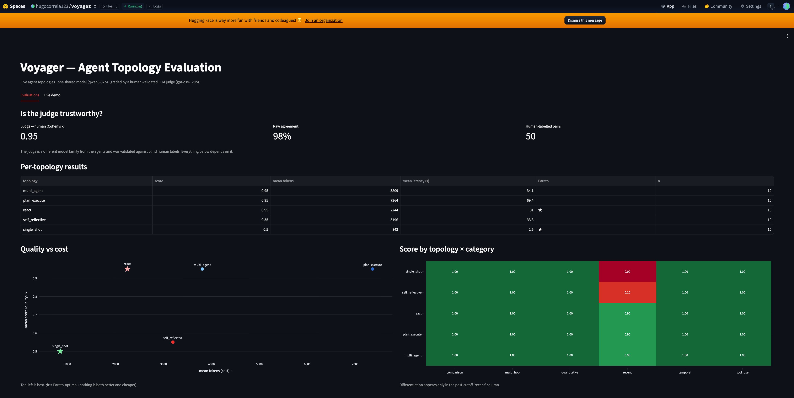
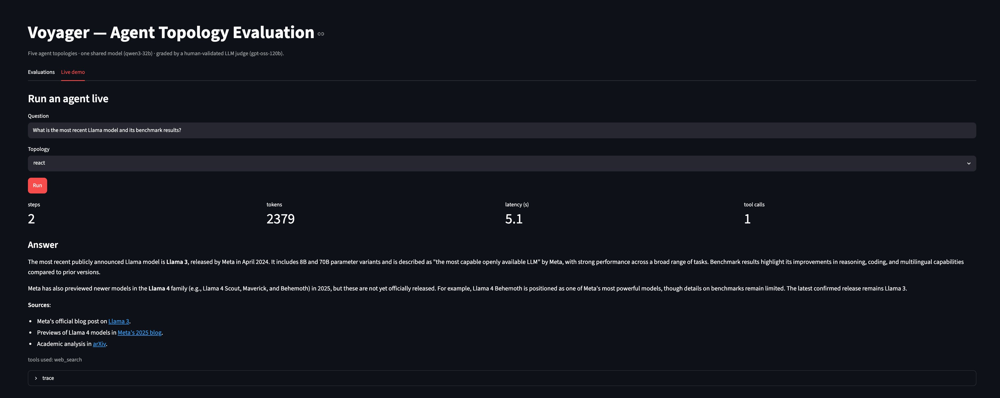

# Mandate — The Sovereign Obligation OS

**Legal AI reads documents. IDP extracts fields. Mandate executes what the enterprise owes — and keeps working when the cloud is gone.**

    

Every contract, court notification, regulation and SLA is a **machine that generates obligations** — pay X by date Y, respond within Z business days, renew, notify. Today those obligations are born in PDFs, live in inboxes, and die in missed deadlines. Mandate compiles them into a living **Obligation Graph** and executes the follow-through — deadline computation, drafted responses, human-gated actions — **inside your perimeter, degrading gracefully all the way down to paper.**

---

## Results

| Claim | Evidence |
|---|---|
| **The dangerous parts never needed the cloud** | The Deadline Engine and Obligation Graph are deterministic, LLM-free code. Due dates compute, obligations track, the ledger holds — with every AI service on earth unreachable. **34 hand-verified deadline cases** across two jurisdictions, green |
| **The LLM proposes; the engine computes — enforced mechanically** | The drafting agent must embed the engine's computed date *verbatim*; a deterministic red-team rejects any draft whose date/amount diverges from the record. On its **first live run the gate blocked a flawed draft** — the critic caught a misleading date the drafter prompt had induced |
| **Cloud extraction is near-perfect; the sovereign tier trades completeness, not correctness** | Zero-shot on 40 unseen documents: **cloud (qwen3-32b) 99.8%** (0 abstentions, 1 error/440 fields). **Local 7B, fully offline, ~6s/doc:** 91% macro — but it **abstains on 7.3% (→ human queue) and errs on only 2.0%**, with errors concentrated in one hard document type, not spread randomly |
| **Extraction quality came from reading disagreements, not guessing** | Prompt-spec iteration, measured each step: **v1 0.83 → v2 0.94 → v3 1.00 → v4 1.00** macro. Every jump traced to a specific, named specification bug found by dumping the model's mistakes |
| **The ledger is tamper-evident by construction** | Every claim, computation, draft, and approval is an append-only, **SHA-256 hash-chained** event. Editing one byte anywhere breaks `verify_chain()` — tested with a forged-record case. Full event-sourced replay from the log |
| **Multilingual, and honest about it per language** | pt-PT + English, measured *separately* — which is how the local model's language-asymmetric weaknesses (EN contract party-attribution) were caught. Two-axis design: language ≠ jurisdiction |



## The thesis

You don't beat Legal AI and IDP by building a smarter reader. You **absorb** them — extraction becomes a subsystem, reading becomes a pipeline stage — and the product becomes the thing enterprises actually need: **a ledger of what they owe, to whom, by when, and the execution of it**, that a regulated European buyer is allowed to deploy. Two doctrines make that real:

**1. The sacred/deterministic split.** Anything with legal consequence — deadline arithmetic, obligation state, the audit trail — is rule-encoded, tested, source-cited code. Courts do not accept "the model estimated." LLMs extract and draft; deterministic code computes and gates; a human approves.

**2. Sovereign & resilient by architecture.** The system runs inside the customer's perimeter and degrades in rungs: frontier LLM → local model → classical heuristics → **rules + playbooks + humans**. An outage is a quality dial, not a failure — and it is logged as an auditable event. This isn't a feature bolted on later; the deterministic core makes it structural.

## Architecture

```
Documents (pt/en · PDFs, scans, mail)
   │  language detected · jurisdiction inferred (two separate axes)
   ▼
PERCEIVE — tiered extraction into one Pydantic contract
   │  every field: typed · confidence-scored · abstains when unsure
   ▼
COMPILE — Obligation Graph
   │  claims (with source spans) → obligations → enforced state machine
   ▼
COMPUTE — the Deadline Engine   ◄── deterministic · LLM-free · cited
   │  jurisdiction packs: PT (CC/CPC/CPA) · EU (Reg. 1182/71)
   ▼
ACT — drafting agent   (embeds the engine's date verbatim)
   ▼
GATE — red team: deterministic checks + hostile LLM critic
   │  only an all-green draft reaches a human
   ▼
APPROVE — human decides   →   SATISFIED
   │
   └─► every step: append-only, SHA-256 hash-chained event log
```

### The measured degradation ladder

The signature artifact. Extraction runs on any rung; the deadline engine is not AI at all, so due dates compute even with everything off. Quality is **measured, not asserted** — 40 documents, per field, per language:

| Rung | Mode | macro (pt / en) | Abstains | Wrong | Character |
|---|---|---|---|---|---|
| **0** | ☁️ Cloud AI — qwen3-32b (Groq) | **1.00 / 0.99** | 0% | 0.2% | best quality; needs egress + key |
| **1** | 🔒 Local AI — qwen2.5-7b (Ollama, **offline**, ~6s/doc on M1 Pro) | **0.92 / 0.88** | 7.3% | 2.0% | **abstains rather than hallucinates**; residual errors concentrated in EN contract party-attribution, not random |
| **2** | ⚙️ Rules only — anchored heuristics | 1.00\* | — | — | \*template-fit ceiling on the synthetic corpus (honesty-noted) |
| **3** | 📋 Playbooks — engine + humans + procedures | — | — | — | the floor that never falls |

The headline finding: **the sovereign 7B tier trades completeness, not correctness.** Offline, it abstains on 7% of fields (routing them to a human) and errs on 2% — and that 2% lives almost entirely in one hard document type (English reciprocal contracts, party attribution), not smeared across everything. A frontier cloud tier reaches 99.8%. You choose the trade; the delta is published, per field, per language, per failure mode. Nobody else in legal-AI shows this table.

## What was built, phase by phase

**Phase 1 — the Deadline Engine + PT jurisdiction pack.** The deterministic heart, built first because everything hangs off it. Three Portuguese counting regimes, each with its statutory basis encoded: `cc_corridos` (Código Civil art. 279.º — event-day exclusion, Sunday/holiday end-roll, and the subtlety that **Saturdays do not roll under the CC**), `cpc_processual` (CPC art. 138.º — continuous counting **suspended during férias judiciais**, computed from the Easter algorithm, with the urgent-process exception and Sat/Sun/holiday end-roll), and `cpa_uteis` (CPA art. 87.º — business days). Every computed deadline returns an **explanation trace with legal references** — the auditable evidence chain. 21 hand-verified cases.

**Phase 1b — the EU jurisdiction pack.** Regulation 1182/71 (`eu_1182_days`, `eu_1182_working_days`, plus weeks/months) with EU-institution holidays. This proved the pack architecture: **the same engine now runs two jurisdictions with contradictory rules** — the CC doesn't roll Saturdays, Reg. 1182/71 does — selected by data, not code. 13 more cases; 34 total.

**Phase 2 — the Obligation Graph.** Typed claims each carrying a source span, a calibrated confidence, and *which tier extracted it* (the ladder is in the data model). Obligations reference their claims — one cannot exist without evidence. An enforced state machine (`PENDING → IN_PROGRESS → AWAITING_APPROVAL → SATISFIED`, illegal transitions raise) makes the human gate structural. And an **append-only, hash-chained event log** with tamper detection and full replay — the "a court may one day read it" ledger, born here, not retrofitted.

**Phase 3a — synthetic corpus + gold set.** A deterministic generator (seed-reproducible) producing 40 realistic obligation-bearing documents (24 pt / 16 en, 5 types) with **distractor dates and amounts by design** — a second date, a second amount — so naive "grab the first match" extractors measurably fail. pt-PT number formatting (`185.435,45`) included as a deliberate trap. Every gold deadline is verified computable through the engine: corpus and engine are provably consistent.

**Phase 3b — tiered extraction, measured.** One Pydantic contract, three tiers behind one interface (Groq cloud / Ollama local / anchored heuristics), abstention-when-unsure as doctrine. The prompt-iteration story is the phase's spine: v1 scored 0.83 with three *specification* bugs (obligation_type defined as document-topic rather than debtor-action; creditor conflated with the court; legal_basis ambiguous between clause and statute), each found by dumping disagreements and fixed by definition, reaching v4 macro 1.00 on cloud. The local-tier's own weaknesses — amount abstention, EN party swaps — were localized the same way.

**Phase 4 — the agent crew.** The pipeline (perceive → compile → compute → act → gate → remember) wiring everything together. The drafting agent receives the engine's computed deadline and must embed it verbatim; a deterministic red-team checks the date, amount, and citation, and a hostile LLM critic attacks the draft — **forbidden from recomputing the engine's date** (the doctrine applies to critics too). On the first live run the gate **correctly blocked a flawed draft**; the post-mortem fixed a locale bug in the amount check and a date-juxtaposition ambiguity in the drafter prompt. LLM failures degrade to a failed check, never a crash.

**Phase 5 — the demo.** A Streamlit app: process a document on any tier, watch the engine's cited trace, read the draft and the red-team verdict, approve into the hash chain. A live **system-mode badge** shows which rungs are available (auto-detecting the Groq key and a local Ollama), and the Method tab publishes the honest benchmark.



## Demo

```bash
git clone https://github.com/hugocorreia123/mandate-the-sovereign-obligation-os
cd mandate-the-sovereign-obligation-os && uv sync
uv run pytest -q                              # 50 passed

# generate the corpus (deterministic, seed 42)
uv run python -c "import sys; sys.path.insert(0,'core'); \
  from corpus import generate_corpus; generate_corpus('data/corpus')"

# process one document end-to-end (rules-only tier — no API key, fully offline)
uv run python scripts/process_document.py data/corpus/docs/pt_cit_000.txt

# with the AI crew (needs GROQ_API_KEY) and/or local Ollama for tier 1
uv run python scripts/process_document.py data/corpus/docs/pt_cit_000.txt --tier tier0 --llm

# the demo
uv run streamlit run app.py
```

To reproduce the ladder benchmark: `uv run python scripts/benchmark_extraction.py --tiers tier2 tier0 tier1` (tier1 needs `ollama pull qwen2.5:7b-instruct`).

## Stack

Python 3.11 · uv · Pydantic (typed extraction contract) · python-dateutil + holidays (deterministic deadline engine) · Groq qwen3-32b (cloud tier + drafter + critic) · Ollama qwen2.5-7b (local sovereign tier) · Streamlit · SHA-256 hash-chained event log

## Scope & limitations

The corpus is synthetic (realistic templates, not scanned real filings — VLM parsing of scans is a documented next phase); jurisdiction packs encode the common regimes and **document their exclusions** (municipal holidays, dilação, the ≥6-month CPC exception, art. 139.º grace days) — a simplified, source-cited engineering implementation, **not legal advice**; tier-2 heuristics score 100% because they are anchored to the corpus templates (a ceiling, honesty-noted, not a claim that regex beats LLMs on real documents); the benchmark is n=40 (directional). Encoded legal rules should be reviewed by a qualified lawyer before any real use.

## Related work by me

Mandate applies a detect → investigate → human-decide pattern to a new domain — **legal obligations, sovereign** — after [Tracer](https://github.com/hugocorreia123/tracer-aml-graph-intelligence) (financial-crime networks, judge κ=0.942), [Turbine](https://github.com/hugocorreia123/turbine-predictive-maintenance) (predictive maintenance, live demo), and [Sentinel](https://github.com/hugocorreia123/sentinel-fraud-mlops) (fraud MLOps). The same discipline throughout: deterministic where it counts, honest baselines, measured findings including the negative ones, and a human in the loop by measured necessity.

---

*Hugo Correia — [LinkedIn](https://www.linkedin.com/in/hugogncorreia) · [GitHub](https://github.com/hugocorreia123) · Data Scientist / ML & AI Engineer, Lisbon*
